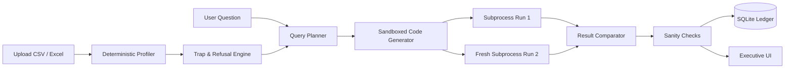

# VerifyAI — Verification-First Data Analyst

> **"Don't blindly trust an AI-generated number. Verify the computation. Expose the assumptions. Refuse when evidence is insufficient."**

[](https://www.python.org/downloads/)
[](https://opensource.org/licenses/MIT)
[](https://streamlit.io/)
[]()

---

## 📌 Problem Statement

Every modern organization is experimenting with generative AI data analysts. However, high-stakes business and financial decisions suffer from a critical vulnerability:
- **Hallucinated Numbers**: LLMs frequently generate plausible-sounding but fabricated figures.
- **Silent Assumptions**: Missing months or ambiguous column names are quietly filled with guesswork.
- **Incompatible Units & Currencies**: Adding numbers across USD and INR or kilograms and litres without warning.
- **Zero Reproducibility**: No way to verify whether an AI-generated number can be independently recomputed from raw data.

---

## 💡 The VerifyAI Solution

**VerifyAI is a verification-first data analytics platform.** 

Every numeric answer presented to the user is backed by executable Python/Pandas code that has been:
1. Checked against factual dataset profiles before planning.
2. Intercepted for fatal data traps (missing timeframes, conflicting sources, mismatched units).
3. Executed in an isolated subprocess.
4. **Re-executed in a brand-new, freshly spawned subprocess.**
5. Mathematically compared for reproducibility (`1e-9` absolute tolerance, `1e-6` relative tolerance).
6. Scrutinized against domain sanity checks.
7. Refused constructively whenever data is insufficient.

> **Positioning:** Verification-first data analytics. Every answer ships with re-executable evidence that can be independently verified. The verifier checks reproducibility and internal consistency, while the system exposes assumptions and refuses when the available data is insufficient.

---

## 🏗️ Architecture & Pipeline Flow



---

## ⚙️ Key Technical Innovations

1. **Deterministic Data Profiler (`profiler/`)**:
   No LLM is ever used to count rows or guess column types. Pure Pandas profiling extracts schemas, duplicate rates, date spans, currencies, physical units, and foreign keys deterministically.
2. **Pre-Flight Trap & Refusal Engine (`traps/`)**:
   Catches temporal gaps (e.g., asking for August revenue when August is missing from the records), currency conflicts (USD + INR), unit mismatches (kg + litres), and contradictory sources.
3. **Dual-Subprocess Verification Protocol (`verifier/`)**:
   Spawns two completely separate, clean subprocesses with scrubbed environment secrets to prove execution reproducibility.
4. **Mathematical Tolerance Comparator (`verifier/result_comparator.py`)**:
   Enforces exact comparison on integers, strings, and keys, while applying floating-point tolerances (`1e-9` abs, `1e-6` rel) to avoid floating-point equality traps (`0.1 + 0.2 != 0.3`).
5. **Persistent SQLite Verification Ledger (`database/`)**:
   Stores every question, intermediate plan, generated code, dual-execution results, and verification verdict in `verifyai.db`.
6. **Zero-Configuration Fallback Mode (`llm/client.py`)**:
   Fully runnable out-of-the-box even without an OpenAI API key using an embedded deterministic semantic planner.

---

## 📁 Repository Structure

```text
verifyai/
├── app.py                      # Modern Streamlit executive dashboard
├── core.py                     # Pipeline orchestrator
├── requirements.txt            # Python dependencies
├── .env.example                # Sample environment configuration
├── .gitignore                  # Git ignore rules
├── README.md                   # Complete documentation
│
├── data/
│   ├── uploads/                # User uploaded datasets
│   └── demo/                   # Realistic demo business datasets & generator
│
├── database/
│   ├── db.py                   # SQLite repository and connection manager
│   ├── models.py               # Pydantic schemas and database models
│   └── schema.sql              # Relational schema definition
│
├── profiler/
│   ├── schema_detector.py      # Types, stats, primary key candidates
│   ├── duplicate_detector.py   # Exact duplicate rows & aggregation advisory
│   ├── missing_detector.py     # Null counts and percentages
│   ├── date_detector.py        # Temporal ranges & missing month detection
│   ├── currency_detector.py    # ISO codes and symbols ($ / ₹ / €)
│   ├── unit_detector.py        # Physical dimensions (kg, litres, meters)
│   ├── relationship_detector.py# Foreign keys & cross-dataset contradictions
│   └── profiler.py             # Combined deterministic dataset profiler
│
├── analyst/
│   ├── prompts.py              # Strict verification prompts
│   ├── planner.py              # Intermediate structured query planner
│   ├── code_generator.py       # Sandboxed Pandas code generator
│   ├── question_parser.py      # Question understanding orchestrator
│   └── response_parser.py      # Evidence packager and formatter
│
├── verifier/
│   ├── executor.py             # Sandboxed subprocess runner (sys.executable)
│   ├── result_comparator.py    # Float tolerance & deep struct comparator
│   ├── sanity_checks.py        # Negative checks, zero checks, NaN/Inf bounds
│   └── verifier.py             # Dual-execution verification engine
│
├── traps/
│   ├── trap_detector.py        # Trap interceptor (months, currencies, units)
│   ├── ambiguity.py            # Calendar vs fiscal explicit assumptions
│   ├── contradictions.py       # Cross-table metric conflict detector
│   └── refusal.py              # 3-part structured refusal payloads
│
├── llm/
│   └── client.py               # OpenAI abstraction + deterministic local fallback
│
├── utils/
│   ├── file_loader.py          # Resilient CSV / Excel loader
│   ├── serialization.py        # Safe JSON serializer for Pandas / Numpy
│   ├── logging.py              # Structured logger with secret scrubbing
│   └── formatting.py           # Currency and number formatting
│
├── tests/
│   ├── test_profiler.py        # Unit tests for profiler modules
│   ├── test_verifier.py        # Unit tests for dual-process verification
│   ├── test_traps.py           # Unit tests for trap detector & ambiguity
│   ├── test_refusal.py         # Unit tests for structured refusal payloads
│   └── adversarial_tests.py    # 20 rigorous end-to-end adversarial scenarios
│
└── docs/
    ├── architecture.md         # In-depth architectural blueprint & diagrams
    ├── demo.md                 # 5-minute hackathon judge demo script
    └── judge_questions.md      # Analysis of 10 weaknesses & judge FAQs
```

---

## 🚀 Quick Start Guide

### 1. Clone & Install Dependencies
```bash
git clone https://github.com/your-username/verifyai.git
cd verifyai

pip install -r requirements.txt
```

### 2. Configure Environment (Optional)
```bash
cp .env.example .env
```
*Note: If `OPENAI_API_KEY` is omitted, VerifyAI automatically runs in high-precision Local Deterministic Engine Mode.*

### 3. Generate Demo Datasets
```bash
python data/demo/create_demo_data.py
```

### 4. Run the Streamlit Application
```bash
streamlit run app.py
```
Open your browser at `http://localhost:8501`.

---

## 🧪 Testing & Validation

VerifyAI includes a comprehensive test suite including **20 adversarial stress scenarios**:

```bash
# Run all unit and adversarial tests
python -m unittest discover tests
```

### 20 Adversarial Test Scenarios Covered
| # | Scenario | Query | Expected Verdict |
|---|---|---|---|
| 1 | Simple Total | "What is the total revenue?" | `ANSWERED` |
| 2 | Average | "What is the average order quantity?" | `ANSWERED` |
| 3 | Maximum | "What is the maximum revenue in a single transaction?" | `ANSWERED` |
| 4 | Minimum | "What is the minimum unit price?" | `ANSWERED` |
| 5 | Group-by | "Which region generated the most revenue?" | `ANSWERED` |
| 6 | Sorting | "Sort regions by total sales volume" | `ANSWERED` |
| 7 | Date Filter | "What was the total revenue in February?" | `ANSWERED_WITH_ASSUMPTIONS` |
| 8 | Trend / MoM | "What was the revenue trend between January and February?" | `ANSWERED_WITH_ASSUMPTIONS` |
| 9 | **Missing Month Trap** | "What was the total revenue in August?" | `REFUSED` |
| 10 | **Missing Column Trap** | "What is the customer satisfaction score (CSAT)?" | `REFUSED` |
| 11 | Duplicate Handling | "What is the total revenue?" | `ANSWERED_WITH_ASSUMPTIONS` (duplicates flagged) |
| 12 | **Currency Mismatch** | "What is combined revenue across USD and INR?" | `REFUSED` |
| 13 | **Unit Mismatch** | "What is combined total of kg and litres?" | `REFUSED` |
| 14 | Ambiguous Date | "Show revenue for February" | `ANSWERED_WITH_ASSUMPTIONS` |
| 15 | **Contradictory Sources**| Conflicting revenue tables without authoritative source | `REFUSED` |
| 16 | Empty Filter | Filter returning zero rows | Warning / 0.0 sanity warning |
| 17 | Nonexistent Product | Filter on non-existent product ID | Sanity warning / 0.0 |
| 18 | Multi-Table Join | "Which product category generated the highest revenue?" | `ANSWERED` (joined on `product_id`) |
| 19 | Multi-Step Query | "Which customer purchased the most in North America?" | `ANSWERED_WITH_ASSUMPTIONS` |
| 20 | **Impossible Query** | "What will Google's stock price be tomorrow?" | `REFUSED` |

---

## 🛑 Constructive Refusal Protocol

When a query is refused, VerifyAI adheres to a transparent 3-part refusal payload:

```text
REFUSED

Reason: August data is not present in the uploaded dataset 'sales.csv'. Available range is 2025-01-05 to 2025-11-26.

Data issue: Temporal gap: Month August missing from date column 'date'.

What would be needed: Provide dataset records for August to compute metrics for this period.
```

---

## 🔒 Security & Sandboxing Constraints

- **Subprocess Isolation**: Untrusted generated code is executed in an isolated process.
- **Environment Scrubbing**: All API keys, secrets, tokens, and credentials are removed from the environment prior to subprocess launch.
- **AST Token Blacklisting**: Forbidden modules (`socket`, `urllib`, `requests`, `shutil.rmtree`) trigger static rejection.
- **Execution Timeout**: Subprocesses terminate automatically after 10 seconds.

---

## ⚖️ Limitations & Responsible Disclosure

- **Verification Scope**: Verifies code execution reproducibility, internal consistency, and data presence; does not guarantee that the human user asked the right business question.
- **Subprocess Constraints**: Designed for local analytics environments. For enterprise deployments, use isolated Linux containers (Docker / gVisor).
- **Dataset Scaling**: Current in-memory Pandas execution is optimized for datasets up to ~5 million rows. Larger datasets benefit from DuckDB or Polars.

---

## 📄 License
This project is open-sourced under the MIT License.
