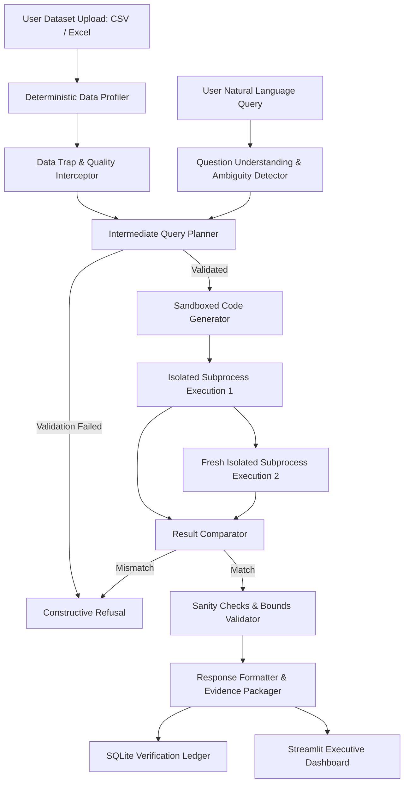

# VerifyAI — System Architecture & Verification Protocol

## 1. High-Level Architectural Overview

VerifyAI is engineered on a fundamental principle: **Never present a numeric answer to a human decision-maker unless it is backed by executable Python code and independently verified in fresh execution environments.**

---

## 2. Component Breakdown

### 2.1 Deterministic Data Profiler (`profiler/`)
Unlike naive AI data analysts that feed row samples to an LLM and ask *"What are the columns and date ranges?"*, VerifyAI relies strictly on deterministic Python/Pandas logic:
- **`schema_detector.py`**: Identifies numeric, categorical, boolean types; computes min, max, mean, quantiles; determines primary key candidates.
- **`duplicate_detector.py`**: Detects exact duplicate rows, computes duplicate percentage, and issues an aggregation-safety advisory.
- **`missing_detector.py`**: Computes null counts and null percentages across all columns.
- **`date_detector.py`**: Parses datetime series, identifies temporal spans, and computes missing calendar periods (e.g., missing months).
- **`currency_detector.py`**: Analyzes column names and string symbols (`$`, `₹`, `€`, `USD`, `INR`) to assign column and dataset-level currencies.
- **`unit_detector.py`**: Detects physical dimensions (`kg`, `litres`, `meters`).
- **`relationship_detector.py`**: Identifies foreign keys and common join columns using set intersection and Jaccard overlap; detects cross-dataset metric contradictions.

---

### 2.2 Trap & Refusal Engine (`traps/`)
Detects fatal data traps before code generation or during plan validation:
1. **Missing Month Trap**: If a user asks for metrics in August, but the date detector proves August is absent, the system constructively refuses.
2. **Incompatible Currency Trap**: If a query attempts to aggregate tables denominated in different currencies (e.g., USD and INR) without a verified conversion rate, the query is refused.
3. **Incompatible Unit Trap**: If metrics attempt to combine incompatible units (e.g., kilograms + litres), the query is refused.
4. **Contradictory Sources Trap**: If multiple datasets assert conflicting claims for the same business metric without an authoritative source specified, the query is refused.
5. **Missing Column / Impossible Queries**: Refuses with a 3-part structured justification:
   - **Reason**
   - **Data Issue**
   - **What Would Be Needed**

---

### 2.3 Sandboxed Dual-Execution Engine (`verifier/`)
To guarantee that an answer is reproducible:
- **Environment Scrubbing**: Sensitive environment variables (`OPENAI_API_KEY`, tokens, passwords) are scrubbed before subprocess launch.
- **Timeouts**: Process execution is terminated if it exceeds 10 seconds.
- **Execution Run 1**: Generates result in subprocess 1.
- **Execution Run 2**: Re-executes identical code in a completely clean, freshly spawned subprocess 2.
- **Mathematical Tolerance Comparator**:
  - Exact comparison for integers, strings, dicts, and lists.
  - Floating-point numbers are compared using `math.isclose` with:
    - Absolute Tolerance: `1e-9`
    - Relative Tolerance: `1e-6`
- **Sanity Checks**: Evaluates domain rules (negative revenue, unexpected zero, division by zero, NaN, infinite values).

---

### 2.4 Persistence Ledger (`database/`)
All dataset profiles, user questions, intermediate plans, generated code, dual-execution outputs, and verification statuses are permanently recorded in SQLite (`verifyai.db`) for full auditability.
